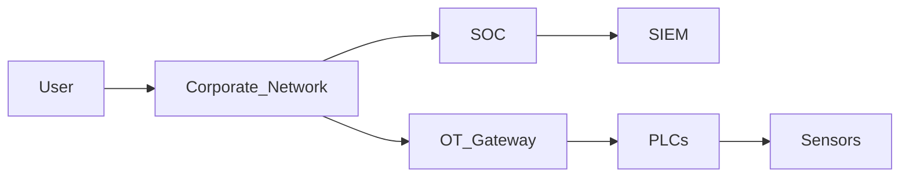

# Natural Park CyberDefense
## 🔍 Laboratório SOC • DFIR • OT/ICS


Projeto profissional de monitoramento, detecção, investigação e resposta a incidentes em ambiente híbrido TI/OT, incluindo DFIR, MITRE ATT&CK, logs simulados, IoCs, playbooks, threat modeling e documentação técnica consolidada.

---

## 🧭 Arquitetura do Ambiente (Mermaid)



---

## 🖼 Arquitetura Visual (PNG/SVG)

Diagramas completos disponíveis na pasta `diagrams/`:

- `diagrams/architecture.png`
- `diagrams/attack-chain.png`
- `diagrams/investigation-flow.svg`

---

## 🎯 Objetivo do Projeto
- Criar um ambiente SOC completo para estudo e portfólio  
- Simular ataques realistas com base em MITRE ATT&CK  
- Gerar documentação DFIR profissional  
- Demonstrar investigação, resposta e contenção  
- Consolidar evidências, IoCs e logs simulados  
- Criar ambientes técnicos com arquitetura e cadeia de ataque  

---

## 📁 Estrutura do Repositório
- `docs/` — Documentação avançada  
- `diagrams/` — Diagramas PNG/SVG  
- `use-cases/` — Casos de uso completos  
- `video/` — Roteiro de vídeo explicativo  
- `ambiente-1/`  
- `ambiente-2/`  
- `ambiente-3/`  

---

## 📚 Conteúdo do Projeto

### 🏞 Cenário Principal
Ambiente corporativo com múltiplos vetores de ataque simulados, incluindo interação com infraestrutura OT/ICS.

### ⚠️ Ameaças Simuladas
- Execução PowerShell maliciosa  
- Exfiltração HTTPS  
- Credential Harvesting  
- Movimento lateral  
- Persistência  
- Manipulação de parâmetros em PLCs  

### 🔗 Cadeia de Ataque
Fluxo completo baseado em MITRE ATT&CK, correlacionando TI → OT → SOC.

### 🧩 Ambientes
Três ambientes completos com arquitetura, incidentes e DFIR.

---

## 🕵️ DFIR
Investigação completa com:
- Timeline  
- Evidências  
- Logs correlacionados  
- Análise técnica  
- Relatório final (`docs/final-report.md`)  

---

## 📄 Logs e IoCs
Logs simulados:
- Sysmon  
- Firewall  
- Wazuh  
- Elastic  
- ICS/OT  
- IoCs reais e simulados  

---

## 🧬 MITRE ATT&CK
Mapeamento completo das técnicas utilizadas:
- T1021 — Remote Services  
- T1041 — Exfiltration  
- T0865 — Manipulation of Control (ICS)  
- T1078 — Valid Accounts  

---

## 🔔 Exemplos de Alertas SIEM
Arquivo completo: `docs/siem-alerts.md`

Inclui:
- Conexão externa suspeita  
- Atividade anômala em PLC  
- Credenciais abusadas  
- Correlação TI → OT  

---

## 🔍 Caso de Uso — Investigação OT/ICS

Arquivo completo: `use-cases/ot-investigation.md`

Resumo:
1. Alerta SIEM dispara  
2. Triagem inicial  
3. Coleta de evidências  
4. Análise correlacionada  
5. Resposta e contenção  
6. Lições aprendidas  

---

## 🎥 Vídeo Explicativo
Roteiro disponível em:

`video/script.md`

---

## 🏷 Topics do Repositório
- SOC  
- DFIR  
- MITRE ATT&CK  
- Threat Hunting  
- Incident Response  
- Blue Team  
- PowerShell  
- Logs  
- IoCs  
- OT/ICS  
- Cybersecurity  

---

## 🛠 Skills Técnicas
- DFIR  
- MITRE ATT&CK  
- Blue Team  
- Threat Hunting  
- Incident Response  
- Logs e Telemetria  
- PowerShell  
- Git  
- OT/ICS Security  

---

## 📑 Documentação Avançada
- `docs/threat-model.md`  
- `docs/final-report.md`  
- `docs/siem-alerts.md`  

---

## 📬 Contato
LinkedIn: [https://www.linkedin.com/in/dionisio-xavier](https://www.linkedin.com/in/dionisio-xavier)  
GitHub: [https://github.com/DionisioXavier1812](https://github.com/DionisioXavier1812)
```
